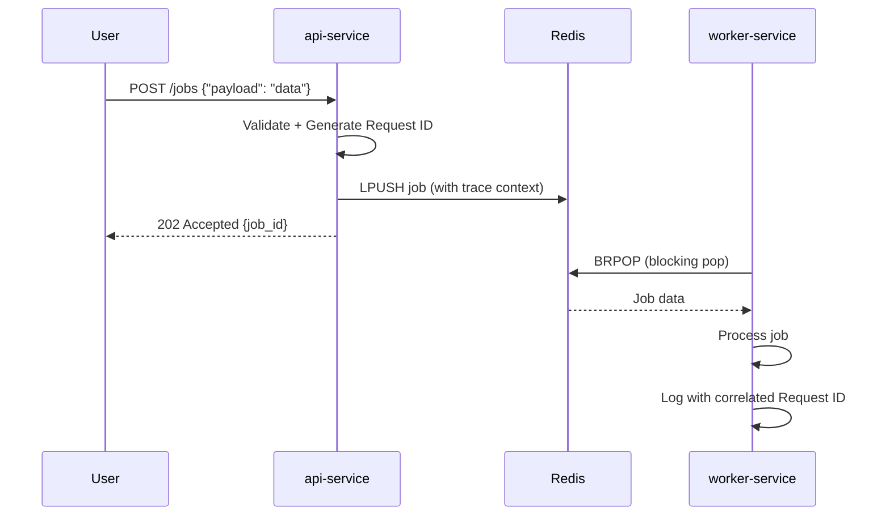

# SRE Platform Application

> **A Production-Grade Microservices Platform for Site Reliability Engineering**

[](https://go.dev/)
[](https://cloud.google.com/kubernetes-engine)
[](https://opentelemetry.io/)
[](https://prometheus.io/)

---

## 📖 Table of Contents

- [Project Overview](#-project-overview)
- [What Was Built](#-what-was-built)
- [Architecture](#-architecture)
- [Project Structure](#-project-structure)
- [Technology Decisions](#-technology-decisions)
- [Getting Started](#-getting-started)
- [API Endpoints](#-api-endpoints)
- [Observability](#-observability)
- [Deployment](#-deployment)
- [Project Status](#-project-status)

---

## 🎯 Project Overview

This repository is the **application layer** of a comprehensive SRE Portfolio project. It demonstrates real-world Site Reliability Engineering practices:

| Principle | Implementation |
|-----------|----------------|
| **Clean Architecture** | Separated concerns into `cmd/`, `internal/`, with clear boundaries |
| **Observability** | Structured logging (Zerolog), distributed tracing (OpenTelemetry), metrics (Prometheus) |
| **Reliability** | Graceful shutdown, health probes, circuit breakers, rate limiting |
| **Security** | Distroless containers, non-root execution, minimal attack surface |
| **Infrastructure** | Kubernetes-native with Helm charts, HPA, PDB |

### Related Repository
- **Infrastructure (Terraform):** [sre-platform-infra](https://github.com/Sanjeevliv/sre-platform-infra) — Provisions GKE cluster, VPC, and Cloud DNS on GCP

---

## 🔨 What Was Built

### The Journey (In Sequence)

#### Phase 1: Foundation ✅
1. **Infrastructure Setup** — Created GKE Autopilot cluster using Terraform
2. **Networking** — Configured VPC, subnets, and firewall rules
3. **Remote State** — Terraform state stored in GCS bucket

#### Phase 2: Application Development ✅
4. **Clean Architecture** — Structured codebase following Go best practices
5. **Microservices** — Built `api-service` and `worker-service`
6. **Configuration** — Environment-based config loading with Viper
7. **Containerization** — Multi-stage Dockerfiles with distroless images
8. **Local Development** — Docker Compose for full-stack testing

#### Phase 3: Observability 🟡 (Partial)
9. **Structured Logging** — JSON logs via Zerolog with request correlation
10. **Distributed Tracing** — OpenTelemetry integration with Jaeger
11. **Metrics** — Prometheus endpoints with custom business metrics
12. **Health Probes** — Liveness (`/healthz`), Readiness (`/ready`), Debug (`/debug/info`)

#### Phase 4: Production Hardening 🟡 (In Progress)
13. **Helm Charts** — Kubernetes deployment automation
14. **Rate Limiting** — Token bucket algorithm protecting API endpoints

---

## 🏗️ Architecture

```
┌─────────────────────────────────────────────────────────────────┐
│                         KUBERNETES CLUSTER                       │
│  ┌─────────────────┐    ┌─────────────────┐    ┌─────────────┐  │
│  │   api-service   │───▶│      Redis      │◀───│   worker    │  │
│  │    (Gin HTTP)   │    │    (Queue)      │    │  (Consumer) │  │
│  └────────┬────────┘    └─────────────────┘    └─────────────┘  │
│           │                                                      │
│           ▼                                                      │
│  ┌─────────────────┐                                            │
│  │     Jaeger      │  ◀── OpenTelemetry Traces                  │
│  │   (Tracing UI)  │                                            │
│  └─────────────────┘                                            │
└─────────────────────────────────────────────────────────────────┘
```

### Data Flow



---

## 📁 Project Structure

```
sre-platform-app/
├── cmd/                          # Application entrypoints
│   ├── api-service/              # HTTP API server
│   │   └── main.go               # Bootstraps server, middleware, graceful shutdown
│   ├── worker-service/           # Background job processor
│   │   └── main.go               # Consumes Redis queue, processes jobs
│   └── platform-healthcheck/     # Lightweight healthcheck binary
│       └── main.go               # Used in Dockerfile HEALTHCHECK
│
├── internal/                     # Private application code
│   ├── api/                      # HTTP handlers and middleware
│   │   ├── server.go             # Route definitions (/healthz, /ready, /metrics, etc.)
│   │   └── middleware.go         # RequestID, RateLimit, Metrics, Logger middleware
│   ├── config/                   # Configuration loading
│   │   └── config.go             # Viper-based env/flag config
│   ├── logger/                   # Structured logging setup
│   │   └── logger.go             # Zerolog initialization
│   ├── metadata/                 # Build information
│   │   └── metadata.go           # Version, CommitSHA, BuildTime (injected at build)
│   ├── queue/                    # Redis queue abstraction
│   │   └── producer.go           # Job enqueueing with circuit breaker
│   ├── telemetry/                # Observability setup
│   │   └── tracing.go            # OpenTelemetry tracer initialization
│   └── worker/                   # Job processing logic
│       └── consumer.go           # Redis consumer with graceful shutdown
│
├── charts/                       # Helm charts for Kubernetes deployment
│   └── sre-platform/
│       ├── Chart.yaml
│       ├── values.yaml
│       └── templates/
│           ├── api-deployment.yaml
│           ├── api-service.yaml
│           ├── api-hpa.yaml
│           ├── worker-deployment.yaml
│           ├── worker-hpa.yaml
│           ├── pdb.yaml
│           └── redis.yaml
│
├── k8s_legacy/                   # Legacy raw Kubernetes manifests (deprecated)
├── Dockerfile                    # Multi-stage build for both services
├── docker-compose.yaml           # Local development stack
├── go.mod / go.sum               # Go module dependencies
└── SRE.txt                       # Master project plan (6 phases)
```

### Why This Structure?

| Directory | Purpose | SRE Benefit |
|-----------|---------|-------------|
| `cmd/` | Thin entrypoints only | Easy to understand startup sequence |
| `internal/` | Business logic hidden | Prevents accidental external imports |
| `internal/api/` | HTTP layer isolated | Can test handlers without full server |
| `internal/queue/` | Queue abstraction | Can swap Redis for SQS/Kafka later |
| `charts/` | Helm-based deployment | Reproducible, parameterized releases |

---

## 🛠️ Technology Decisions

### Why Go?
- **Performance**: Compiled, statically typed, low memory footprint
- **Concurrency**: Goroutines for handling thousands of connections
- **Small Binaries**: ~10MB final image size
- **Cloud Native**: First-class Kubernetes, Prometheus, OTel support

### Why Gin Framework?
- **Fast**: One of the fastest Go HTTP routers
- **Middleware Ecosystem**: Easy to add logging, tracing, auth
- **Production Proven**: Used by companies like Grab, Riot Games

### Why Zerolog for Logging?
- **Zero Allocation**: Fastest structured logger for Go
- **JSON Output**: Machine-parseable for log aggregation
- **Context Integration**: Easy request ID propagation

### Why OpenTelemetry?
- **Vendor Neutral**: Export to Jaeger, Zipkin, Google Cloud Trace, etc.
- **Future Standard**: CNCF project, replacing OpenTracing/OpenCensus
- **Auto-instrumentation**: Middleware for Gin included

### Why Distroless Containers?
- **Security**: No shell, no package manager, no attack surface
- **Size**: ~3MB base vs ~5MB Alpine vs ~100MB Debian
- **CVE-Free**: No OS packages to patch

---

## 🚀 Getting Started

### Prerequisites

- Go 1.21+
- Docker & Docker Compose
- `kubectl` (for Kubernetes deployment)
- `helm` (for Helm deployment)

### Local Development

```bash
# Clone the repository
git clone https://github.com/Sanjeevliv/sre-platform-app.git
cd sre-platform-app

# Start the full stack (API, Worker, Redis, Jaeger)
docker-compose up --build

# In another terminal, test the API
curl http://localhost:8080/healthz
# Output: ok

curl http://localhost:8080/version
# Output: {"version":"dev","commit_sha":"none","build_time":"unknown","go_version":"go1.25"}

# Submit a job
curl -X POST http://localhost:8080/jobs \
  -H "Content-Type: application/json" \
  -d '{"payload": "Hello SRE World"}'
# Output: {"job_id":"uuid-here","status":"queued"}

# View traces
open http://localhost:16686  # Jaeger UI
```

### Environment Variables

| Variable | Default | Description |
|----------|---------|-------------|
| `API_PORT` | `8080` | HTTP server port |
| `REDIS_ADDR` | `localhost:6379` | Redis connection string |
| `GIN_MODE` | `debug` | Gin mode (`debug`/`release`) |
| `OTEL_EXPORTER_OTLP_ENDPOINT` | `localhost:4318` | OpenTelemetry collector |
| `RATE_LIMIT_RPS` | `100` | Requests per second limit |
| `RATE_LIMIT_BURST` | `200` | Burst capacity |

---

## 📡 API Endpoints

| Endpoint | Method | Purpose | Response |
|----------|--------|---------|----------|
| `/` | GET | Root handler | `SRE Platform API Service` |
| `/healthz` | GET | Liveness probe | `ok` |
| `/ready` | GET | Readiness probe | `ready` |
| `/version` | GET | Build metadata | `{"version":"...","commit_sha":"..."}` |
| `/debug/info` | GET | Runtime diagnostics | `{"goroutines":5,"memory_alloc":...}` |
| `/metrics` | GET | Prometheus metrics | Prometheus text format |
| `/jobs` | POST | Submit background job | `{"job_id":"...","status":"queued"}` |

### Health Probes Explained

```yaml
# Kubernetes uses these probes:
livenessProbe:
  httpGet:
    path: /healthz    # "Am I alive?" - restart if fails
readinessProbe:
  httpGet:
    path: /ready      # "Can I serve traffic?" - remove from LB if fails
```

---

## 📊 Observability

### The Three Pillars

#### 1. Logs (Structured JSON)
```json
{
  "level": "info",
  "request_id": "abc-123",
  "method": "POST",
  "path": "/jobs",
  "status": 202,
  "latency_ms": 15,
  "message": "request completed"
}
```

#### 2. Traces (OpenTelemetry → Jaeger)
- Every request gets a trace ID
- Spans created for HTTP handlers, Redis operations
- View in Jaeger UI at `http://localhost:16686`

#### 3. Metrics (Prometheus)
```
# Custom business metrics
http_requests_total{method="POST",path="/jobs",status="202"} 150
http_request_duration_seconds_bucket{le="0.1"} 145
```

### Correlation

All three pillars share the same `request_id`:
- **Log**: `"request_id": "abc-123"`
- **Trace**: `trace_id` in Jaeger
- **Metric Labels**: (future: exemplars)

---

## 🚢 Deployment

### Option 1: Helm (Recommended)

```bash
# From project root
helm upgrade --install sre-platform ./charts/sre-platform \
  --set api.image.repository=us-central1-docker.pkg.dev/PROJECT_ID/sre-portfolio-repo/api-service \
  --set api.image.tag=latest \
  --set worker.image.repository=us-central1-docker.pkg.dev/PROJECT_ID/sre-portfolio-repo/worker-service \
  --set worker.image.tag=latest
```

### Option 2: Docker Compose (Local)

```bash
docker-compose up --build
```

### Option 3: Raw Kubernetes (Legacy)

```bash
kubectl apply -f k8s_legacy/
```

---

## 📋 Project Status

### Completed ✅
- [x] Clean Architecture (`/cmd`, `/internal`)
- [x] Gin HTTP framework with middleware stack
- [x] Graceful shutdown with context cancellation
- [x] Configuration via environment variables (Viper)
- [x] Multi-stage Dockerfile with distroless base
- [x] Docker Compose for local development
- [x] Zerolog structured JSON logging
- [x] OpenTelemetry distributed tracing
- [x] Prometheus metrics endpoint
- [x] Health probes (`/healthz`, `/ready`, `/version`, `/debug/info`)
- [x] Request ID middleware for log correlation
- [x] Rate limiting middleware
- [x] Helm charts with HPA

### In Progress 🟡
- [ ] Inject `trace_id` into all logs
- [ ] Define SLIs/SLOs in documentation
- [ ] Create Grafana dashboards
- [ ] GitHub Actions CI/CD pipeline
- [ ] cert-manager for automatic HTTPS

### Planned 📝
- [ ] Network Policies (deny-all default)
- [ ] External Secrets Operator
- [ ] Chaos engineering endpoints
- [ ] Load testing with k6
- [ ] Portfolio website at sanjeevsethi.in

---

## 📚 References

- [Google SRE Book](https://sre.google/sre-book/table-of-contents/)
- [OpenTelemetry Go](https://opentelemetry.io/docs/instrumentation/go/)
- [Gin Web Framework](https://gin-gonic.com/)
- [Prometheus Go Client](https://github.com/prometheus/client_golang)
- [Zerolog](https://github.com/rs/zerolog)

---

## 📄 License

MIT License - See [LICENSE](LICENSE) for details.
# CI/CD Pipeline Enabled
