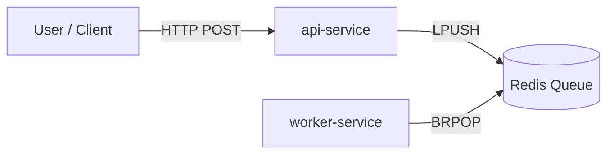

# SRE Platform Application (sre-platform-app)

**A Cloud-Native Microservices Architecture for Reliability Engineering**

> **Project Status:** ✅ Phase 1 & 2 Complete | 🚧 Phase 3 In Progress

## 📖 Project Overview

This project represents the **Application Layer** of a comprehensive SRE Portfolio. It is designed not just as a functional application, but as a testbed for demonstrating Site Reliability Engineering (SRE) principles: **Fault Tolerance, Observability, and Infrastructure as Code (IaC).**

The application runs on top of the "Platform" defined in the [`sre-platform-infra`](https://github.com/sanjeevsethi/sre-platform-infra) repository, which provisions a GKE Autopilot cluster, Networking, and IAM on Google Cloud Platform (GCP).

### 🎯 The Goal
To build a system specifically designed to be *broken* and *monitored*, allowing for the practice of real-world SRE scenarios such as:
*   SLO/SLI definition and tracking.
*   Chaos engineering and fault injection.
*   Incident response and post-mortem analysis.

## 🏗️ Architecture & Workflow

The system follows an asynchronous, decoupled microservices architecture to ensure scalability and fault isolation.

**Data Flow:**
1.  **Ingestion:** Users send HTTP requests to the `api-service`.
2.  **Queuing:** The `api-service` validates the request and pushes a job to a **Redis** list (acting as a message queue).
3.  **Processing:** The `worker-service` (running as a background daemon) asynchronously pulls jobs from Redis and processes them.



### Key Components
*   **GKE Autopilot:** Managed Kubernetes for zero-maintenance cluster operations.
*   **Go (Golang):** Selected for high performance, concurrency, and small binary sizes.
*   **Redis:** Decouples the ingestion from processing, allowing the API to remain responsive even during high load.
*   **Prometheus:** Both services are instrumented with custom metrics to expose internal state (e.g., queue depth, processing time).

## 💡 Design Philosophy

### 1. Security & Efficiency First
We use **multi-stage Docker builds** to create `scratch` based images unless debugging is required. This results in:
*   **Tiny Images:** < 15MB total size.
*   **Zero CVEs:** No OS base layer means no OS vulnerabilities.
*   **Non-Root Execution:** Containers run as unprivileged users.

### 2. Cost-Aware Cloud Native
The entire platform runs on a strict **GCP Budget**.
*   **Cost Control:** Resources are provisioned in a new, segregated GCP account with active budget alerts.
*   **Autopilot:** We only pay for the pods we run, not the underlying nodes, optimizing costs for this portfolio scale.

### 3. Observability as Code
Monitoring is not an afterthought. The services expose `/metrics` out of the box, and the infrastructure is ready for OpenTelemetry integration (Phase 3).

---

## 🚀 Deployment & Usage

### Prerequisites
*   Google Cloud SDK (`gcloud`) authenticated to the project.
*   `kubectl` configured for the `sre-platform-cluster`.
*   Docker installed for local builds.

### Quick Start
1.  **Build & Push Images:**
    ```bash
    # Update with your PROJECT_ID and REGION
    export PROJECT_ID=your-project-id
    export REGION=us-central1
    
    docker build -t $REGION-docker.pkg.dev/$PROJECT_ID/sre-portfolio-repo/api-service:latest -f Dockerfile .
    docker push $REGION-docker.pkg.dev/$PROJECT_ID/sre-portfolio-repo/api-service:latest
    
    docker build -t $REGION-docker.pkg.dev/$PROJECT_ID/sre-portfolio-repo/worker-service:latest -f Dockerfile.worker .
    docker push $REGION-docker.pkg.dev/$PROJECT_ID/sre-portfolio-repo/worker-service:latest
    ```

2.  **Deploy to Kubernetes:**
    ```bash
    kubectl apply -f k8s/
    ```

3.  **Verify Status:**
    ```bash
    kubectl get pods
    # All pods should be in 'Running' state
    ```

---

## 🗺️ Roadmap: Phase 3 (The SRE Core)

We are currently in **Phase 3**, focusing on advanced observability and reliability features.

| Status | Action |
| :--- | :--- |
| ◯ | **Structured Logging:** Enforce JSON logging with Zap/Zerolog. |
| ◯ | **Distributed Tracing (OTel):** Integrate OpenTelemetry SDK for end-to-end tracing. |
| ◯ | **Correlation IDs:** Implement Trace ID propagation (`api-service` → `worker-service`). |
| ◯ | **SLO Definition:** Define SLOs (99.9% Availability) and build Golden Signals dashboard. |
| ◯ | **Alerting:** Configure alerts for high Error Budget burn. |

---

## 📋 Comprehensive Project Status Checklist

<details>
<summary>Click to view completed Phase 1 & 2 Checklists</summary>

### Phase 1: Infrastructure Migration & Provisioning
| Status | Action |
| :--- | :--- |
| ✓ | **Local State Cleanup:** Removed local Terraform state files. |
| ✓ | **Authentication Switch:** Logged into new GCP account and set the new project ID. |
| ✓ | **Code Updates:** Updated project ID in `variables.tf`. |
| ✓ | **Backend Reconfiguration:** Updated `provider.tf` with the new GCS backend. |
| ✓ | **Manual Backend Creation:** Created new GCS bucket for remote state. |
| ✓ | **API Enablement:** Enabled necessary APIs (Compute, Container). |
| ✓ | **Resource Naming:** Standardized VPC and Subnet names to `sre-platform-*`. |
| ✓ | **Provisioning:** Successfully ran `terraform apply` (GKE Autopilot cluster created). |
| ✓ | **Budget Control:** Set up low-limit Budget Alert. |
| ✓ | **Cluster Connection:** Configured `kubectl` to communicate with the new cluster. |

### Phase 2: Application Deployment
| Status | Action |
| :--- | :--- |
| ✓ | **Image Registry Setup:** Created Artifact Registry repo (`sre-portfolio-repo`). |
| ✓ | **Docker Authentication:** Configured Docker to push images to the new registry. |
| ✓ | **Build and Push:** Built and pushed container images for both Go services. |
| ✓ | **Manifest Creation:** Created YAMLs and corrected deployment discrepancies. |
| ✓ | **Deployment:** Successfully ran `kubectl apply -f k8s/`. |
| ✓ | **Troubleshoot:** Resolved ImagePullBackOff; confirmed pods are Running. |

</details>
